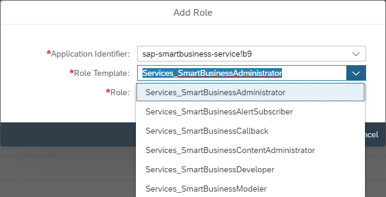
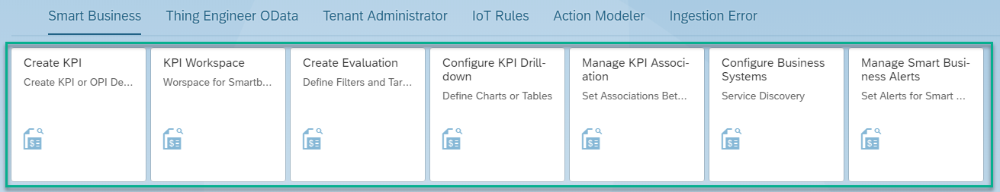
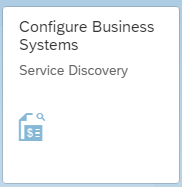
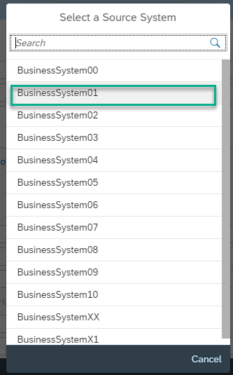
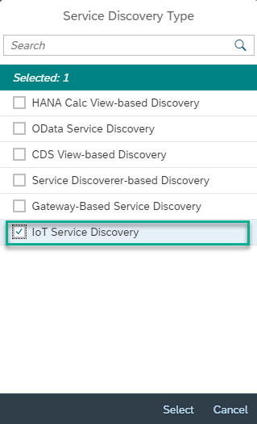
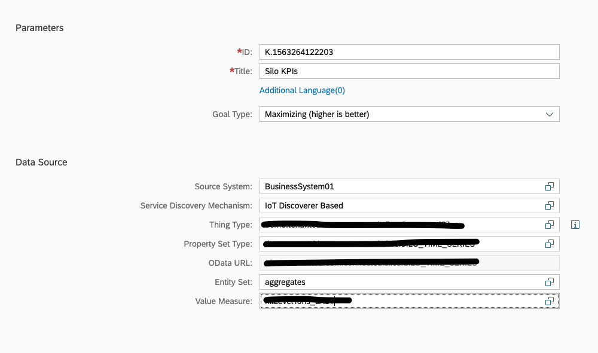
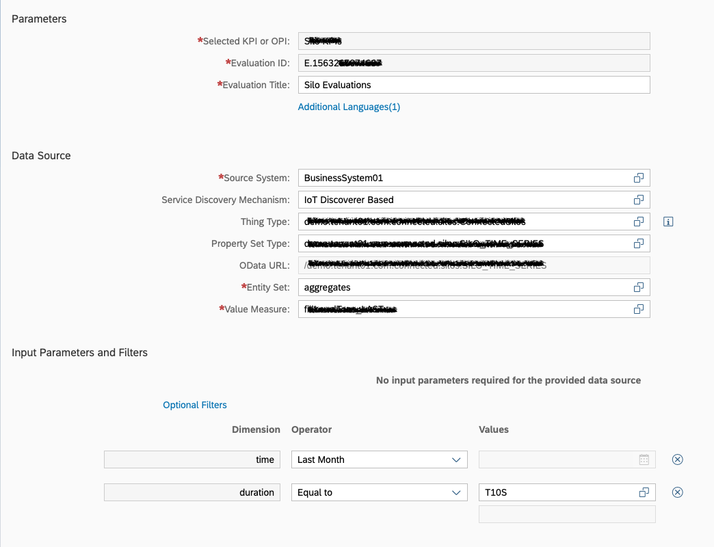

# Creating Smart Business Charts and Consuming in the Application


## Adding Smart Business Roles
* Please create a role collection and add all smart business roles as mentioned below and assign the role collection to the respective users.

|Application Identifier|Role Template| Role|
|--|--|--|
|sap-smartbusiness-service!b9|Services_SmartBusinessAdministrator|Services_SmartBusinessAdministrator|
|sap-smartbusiness-service!b9|Services_SmartBusinessAlertSubscriber|Services_SmartBusinessAlertSubscriber|
|sap-smartbusiness-service!b9|Services_SmartBusinessCallback|Services_SmartBusinessCallback|
|sap-smartbusiness-service!b9|Services_SmartBusinessContentAdministrator|Services_SmartBusinessContentAdministrator|
|sap-smartbusiness-service!b9|Services_SmartBusinessDeveloper|Services_SmartBusinessDeveloper|
|sap-smartbusiness-service!b9|Services_SmartBusinessModeler|Services_SmartBusinessModeler|




## Smart Business Applications

Access the Smart Business Tiles from the Launchpad. This is the same launchpad used for all the Thing Modeler configurations.


## Business System Configuration

Smart Business can create Analytical dashboards by consuming the aggregates from any OData service.

These OData services can be registered via Business Systems concept.

Leonardo IoT generated one Business System called "BusinessSystem01" by default to expose the analytics OData service. We can use this OData service to configure Smart Business Dashboards.

Here are the steps to configure OData Service Lookup for Smart Business.
* Click "Configure Business Systems" Tile.


* Click on "Source System" and choose "BusinessSystem01"


* Scroll down, click on "Service Discovery Type" and choose "IoT Service Discovery"


* Click Save and navigate to Home


## Creating KPI

* Click on "Create KPI" tile.
* Provide Title
* Choose Source System as **BusinessSystem01** 
* Choose Service Discovery Mechanism as **IoT Discoverer Based**
* Select your Thing Type
* Select Property Set Type which needs to be used for the KPI. 
* OData URL gets pre-populated 
* Choose entityset as **aggregates**.
* Choose any measure to visualize them in the KPI Charts based onyour scenario.
Below screenshot will give you an idea on how this looks.



* Click on Activate. This will save and activate the KPI.

## Create Evaluation

After creating the KPI, we need to create Evaluation under this KPI. 
* Go back to home
* Click on "Create Evaluation" tile.
* Select the newyl created KPI
* Provide title.
*In case you need filters to be added to the Evaluations, it can be configured in the last section called **Input Parameters and Filters**.

Note: time and duration are necessary to be added as filters for the OData that is being used to create the Smart Business Charts.


The different values that can be passed as filter for duration are documented in this [help](https://help.sap.com/viewer/350cb3262cb8496b9f5e9e8b039b52db/1.73.0.0/en-US/4889f896a14749d581db25666e525ae8.html) document.

* Choose the Filters as per below screenshot.



* click on Activate. This will create and activate the evaluation.

## Configure KPI Drill-down

The last step before configuring the smart business charts in the UI is configuring the KPI drill down. 

* Go to Home
* Click on **Configure KPI Drill-down**
* Select the newly created Evaluation
* Click on **Configure** button in the footer. This takes you to Drill-Down Chart Configuration screen where type of visualization, dimensions and measures are selected. 
* Dimension is usually selected as time in case of the *aggregates* OData. 
* Provide a title for the view
* Select appropriate options from Visualization Type.
* Click on Save View.


## Adding Smart Business Charts in ThingPage

Navigate to the application's webapp folder and go to views->ThingPage.view.xml. This is the place where all the different sections of the Thing Page are configured to be displayed during the runtime. To add the smart business chart in the this view, add the following snippet into a new section or replace an existing section from the Object Page Layout.

```xml
<ObjectPageSection title="{i18n>analyticsSubTitle1}">
	<subSections>
		<ObjectPageSubSection title="Smart Business Control">
			<blocks>
				<businesscontrol:Kpi evaluationId="<evaluationId>" showAggregate="false" showFilters="false" showMiniChart="true" showChart="true"
					showKpiTitle="false" showEvaluationTitle="false" height="700px"/>
			</blocks>
		</ObjectPageSubSection>
	<subSections>
</ObjectPageSection>
```

The **evaluationId** has to be replaced by the evaluation ID that has been created for your use case. To find out this ID, go to Launchpad and click on "KPI Workspace", select the KPI created by you and select one of the evaluation ID for this KPI. A single KPI can have multiple evaluation IDs. Other properties like showAggregate, showFilters etc. can be configured based on your use case.
